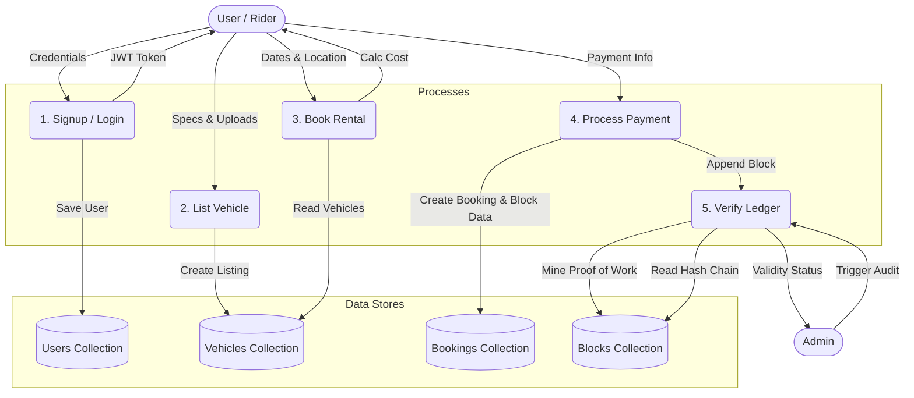
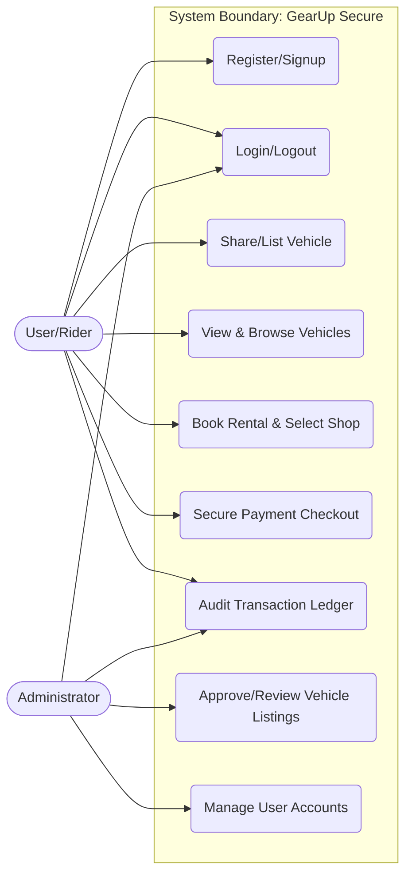
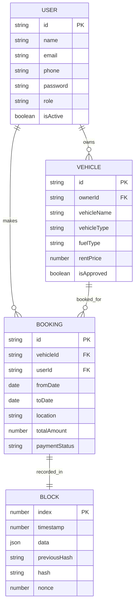

# GEARUP SECURE: CYBER-SECURE PEER-TO-PEER VEHICLE RENTAL LEDGER SYSTEM

---
**GEARUP SECURE**  
**Course Code / Class**: Department of MCA, MITE  
**Year**: 2025-26  

---

## CHAPTER 1: INTRODUCTION

### 1.1 General Introduction
In the modern sharing economy, peer-to-peer (P2P) vehicle rental platforms have emerged as a highly efficient way to utilize underused resources, allowing individuals to rent out their cars and bikes to other members of their community. However, centralized P2P platforms face significant cyber-security challenges. Data tampering, fraudulent rental claims, unauthorized access to user session details, and distributed denial-of-service (DDoS) threats compromise user trust and database integrity. Additionally, central database registries are vulnerable to single-point-of-failure vulnerabilities, where compromised administrative credentials allow malicious actors to alter booking histories, prices, or vehicle ownership logs.

**GearUp Secure** is designed to address these core security vulnerabilities by combining a robust MERN-stack web architecture with a server-side cryptographic ledger inspired by blockchain principles. Every booking made on the platform is cryptographically mined as a block using SHA-256 hashes linked in an immutable chain. This ensures that any attempt to retroactively tamper with rental histories or booking states will immediately break the hash linkage, triggering security alerts during routine cryptographic audits. By integrating Helmet-driven secure headers, strict API rate-limiters, input sanitization, dynamic offline database fallbacks, and interactive shop pickup maps, GearUp Secure provides a state-of-the-art cyber-secure environment for peer-to-peer vehicle sharing.

---

### 1.2 Objectives of the Project
* **Immutable Transaction Logging**: To implement a server-side blockchain-inspired booking ledger using SHA-256 hashing to record all vehicle rental transactions in an untamperable audit chain.
* **Tamper Detection Auditing**: To build an automated cryptographic validation engine that allows both administrators and users to audit the booking ledger and pinpoint exactly where database tampering has occurred.
* **Interactive Pickup Points mapping**: To integrate Leaflet.js interactive maps that fetch and display real-world pickup coordinates of nearest rental shops based on selected checkout locations.
* **Enhanced Client-Server Security**: To apply Helmet middleware secure HTTP headers, sanitization hooks protecting against Cross-Site Scripting (XSS) injections, and strict IP rate limiters to guard against brute-force and DDoS attacks.
* **Robust Offline Fault Tolerance**: To construct an automated connection selector that switches the backend database dynamically to a local file-based database (`mock_db/`) when external MongoDB Atlas cloud connections fail.
* **Separated Multistep Checkout**: To decouple checkout info and card credentials into a dedicated standalone Payment component to improve transaction isolation and page routing state safety.

---

### 1.3 Existing System
Current commercial vehicle rental applications rely on centralized database architectures (SQL/NoSQL) with standard access controls. The primary limitations of these systems include:
* **Vulnerability to Unauthorized Database Access**: If a malicious actor gains write access to the database (via SQL injection, compromised cloud keys, or internal threats), they can modify historical transaction details, booking durations, and rental amounts undetected.
* **Lack of Historical Integrity Checkers**: Standard database tables store records independently. There is no cryptographic link connecting historical records, meaning changed rows do not trigger structural mismatch warnings.
* **Over-reliance on Cloud Availability**: If the cloud database cluster experiences latency, DNS resolution blockages, or outages, the entire booking API crashes, causing server downtime.
* **Monolithic Booking Interfaces**: Combining pickup location searches, map integrations, card validations, and booking submits on a single page increases DOM complexity, making payment credentials vulnerable to page-state sniffing.

---

### 1.4 Proposed System
GearUp Secure introduces an integrated, security-first vehicle discovery and immutable transaction framework. The proposed system resolves the limitations of the existing systems through the following features:
* **SHA-256 Ledger Mining**: Every rental transaction is mined into a secure ledger block using a Proof-of-Work (PoW) consensus algorithm with custom node difficulty levels.
* **Cryptographic Verification Suite**: Provides a validation function that checks block linkages (`currentBlock.previousHash === previousBlock.hash`) and recalculates stored hashes to detect database discrepancies.
* **Dynamic Connection Manager**: Uses a 3-second connection timeout that seamlessly redirects Express API queries to a local file-backed JSON database selector when MongoDB Atlas is unreachable.
* **Isolated Checkout Component**: Implements a separate `/payment` route that securely handles transaction billing separately from date and shop selection.
* **Zero-External Google OAuth Footprint**: Uses robust local authentication with `bcryptjs` password hashing and secure token-based logins, removing external Google tracking scripts.
* **Leaflet Shop Coordinates Mapper**: Mounts an active Leaflet map displaying real-world shop coordinates (Mumbai, Bangalore, Pune, etc.) with auto-updating select dropdowns when shop pins are clicked.

---

### 1.5 Feasibility Study

#### Technical Feasibility
The application is built on the MERN stack (MongoDB, Express, React, Node.js) combined with modern frontend tools (Vite, Redux, Tailwind CSS). Node.js natively supports core cryptographic modules (`crypto`) for hashing. React's modular structure allows Leaflet.js to be easily initialized using DOM refs in React hooks. The chosen stack is highly mature, well-documented, and runs seamlessly across diverse runtime environments, making the project technically feasible.

#### Economic Feasibility
The project utilizes entirely open-source libraries, packages, and frameworks. Database storage can be run locally or hosted on MongoDB Atlas's free cloud tier. Frontend and backend deployment can be executed on free-tier platforms like Render or Vercel. Since no proprietary software licenses, hardware accelerators, or paid database APIs are required, the economic feasibility is excellent.

#### Operational Feasibility
The system is designed with a highly responsive, clean user dashboard. Users only need standard internet literacy to browse vehicles, select dates, interact with the Leaflet map, and confirm checkout. Administrators are provided with simple consoles to approve vehicle listings and run structural cryptographic audits with a single click.

---

## CHAPTER 2: REVIEW OF LITERATURE

### 2.1 Review – Summary

| Sl. No. | Author / Source | Summary | Relevance to GearUp Secure |
|---|---|---|---|
| 1 | Satoshi Nakamoto (Bitcoin Whitepaper) | Outlines the concept of an immutable ledger where blocks are chained cryptographically using proof-of-work. | Underpins the design of our server-side transaction logging ledger using previous-hash verification. |
| 2 | OpenStreetMap contributors (osm.org) | Provides free, open-source geographic database tiles for rendering maps. | Serves as the mapping layer for rendering shop location pins without licensing fees. |
| 3 | OWASP Web Security Testing Guide | Documents standard security checks, including rate limiting, input sanitization, and Helmet header configuration. | Guides the implementation of Helmets secure headers, XSS sanitizers, and Express rate limiters. |
| 4 | Mongoose ODM Documentation | Details Object Data Modeling for Node.js to create schemas, validation logic, and query hooks. | Used to build strict database models for users, vehicles, and ledger blocks. |
| 5 | Leaflet.js Documentation | Details dynamic map construction using lightweight client-side scripts. | Used to implement the interactive shop picker on the booking screen. |

---

## CHAPTER 3: SYSTEM CONFIGURATION

### 3.1 Hardware Requirements

| Component | Minimum Specification | Recommended Specification |
|---|---|---|
| Processor | Intel Core i3 or equivalent | Intel Core i5 / AMD Ryzen 5 or higher |
| RAM | 4 GB | 8 GB or higher |
| Storage | 2 GB free disk space | SSD with 5 GB free disk space |
| Network | Standard broadband connection | High-speed fiber internet |
| Display | 1024 x 768 resolution | 1920 x 1080 resolution |

---

### 3.2 Software Requirements

| Category | Software | Version Used |
|---|---|---|
| Operating System | Windows 10/11, macOS, or Linux | Windows 11 (Any) |
| Runtime Environment | Node.js | v18.0.0 or higher (v24.15.0 used) |
| Database Engine | MongoDB | v6.0 or higher |
| Backend Framework | Express.js | v4.19.2 |
| Frontend Bundler | Vite | v6.2.0 |
| Frontend Library | React | v19.0.0 |
| CSS Framework | Tailwind CSS | v3.4.17 |
| Object Modeling | Mongoose | v8.2.1 |
| Cryptography Library | bcryptjs | v2.4.3 |
| HTTP Client | Axios / Fetch API | Native Fetch |
| Maps API | Leaflet.js | v1.9.4 |
| State Management | Redux Toolkit | v2.6.0 |

---

## CHAPTER 4: MODULE DESCRIPTION

### 4.1 Modules

#### 1. User Authentication & Authorization Module
* **Local Password Security**: Handles account creation and login. User passwords are hashed using `bcryptjs` with a work salt factor of 10 prior to storage.
* **JWT Access Controls**: Generates JSON Web Tokens upon authentication. The token is stored in the browser's `localStorage` and sent in headers, securing API calls.
* **Input Sanitization Middleware**: Intercepts request parameters and recursively cleans string values of script elements to block Cross-Site Scripting (XSS).
* **IP Rate Limiting**: Implements rate limits: 10 attempts per 10 minutes on authentication, and 100 requests per 15 minutes globally.

#### 2. Vehicle Listing & Management Module
* **CRUD Vehicles**: Allows verified users to list cars or bikes for rent. Car schemas capture doors, luggage capacity, and transmission, while bike schemas capture cc, ABS, and top box details.
* **Image Proxy Handler**: Implements a secure Express file proxy route (`/api/files/preview/:fileId`) to serve uploaded assets without exposing direct backend folder paths.
* **Status Toggles**: Provides owners with active/inactive dashboard switches to quickly list or hide vehicles from the public directory.

#### 3. Checkout & Payment Module (Decoupled)
* **Booking Coordinator**: Collects dates and location. Uses date-fns to prevent booking vehicles with dates in the past or end-dates preceding start-dates.
* **Leaflet Pickup Shop Mapper**: Dynamically loads real-world shop coordinates (Mumbai, Bangalore, Manipal, etc.) on an interactive map. Selecting a shop pin updates the pickup location dropdown.
* **Standalone Payment Redirection**: A standalone `/payment` component that isolates billing fields. Card data is validated and a pending booking is written to the database.

#### 4. Cryptographic Blockchain Ledger Module
* **Block Serialization**: Packages booking data (vehicle, dates, cost, user) into a ledger block.
* **Proof-of-Work Miner**: Runs a mining loop that increments a block `nonce` until the block hash satisfies a difficulty target (leading zeros).
* **Structural Ledger Audit**: Checks each block against its recalculated hash and verifies that `currentBlock.previousHash === previousBlock.hash`. If any mismatch is found, the audit reports the exact tampered index.

---

## CHAPTER 5: SYSTEM DESIGN

### 5.1 Data Flow Diagram (DFD)

#### Level 1 DFD – Process Flow Diagram


#### Level 1 DFD – Student (User) Processes

| Process | Input Data | Target Data Store | Process Description |
|---|---|---|---|
| 1. Signup / Sign in | Credentials, User Info | Users Collection | Validates input, hashes password, saves to Users collection, and returns JWT. |
| 2. List Vehicle | Specifications, Image File | Vehicles Collection, uploads/ | Uploads vehicle specifications and images, links to user ID, and lists as active. |
| 3. Book Rental | Dates, Location, Shop | Bookings Collection | Validates rental date ranges, maps closest shop, and calculates total due. |
| 4. Process Payment | Billing info, Authorization | Bookings Collection | Validates card parameters, creates booking record, and marks status as pending. |
| 5. Verify Blockchain | Verification Request | Blocks Collection | Reads ledger blocks, verifies hashes sequentially, and returns validity state. |

#### Level 1 DFD – Admin Processes

| Process | Input Data | Target Data Store | Process Description |
|---|---|---|---|
| 1. Dashboard Metrics | Read request | All Collections | Aggregates and returns counts of bookings, vehicles, and active users. |
| 2. Approve Vehicle | Approve Toggle | Vehicles Collection | Reviews vehicle specifications and toggles status to public listing. |
| 3. Manage Bookings | Booking ID | Bookings Collection | Reviews booking requests and cancels/deletes records if requested. |
| 4. Structural Audit | Audit trigger | Blocks Collection | Traverses blocks collection to run cryptographic sequence verification. |

---

### 5.2 Use Case Diagram



### 5.3 Entity Relationship (ER) Diagram



---

## CHAPTER 6: SYSTEM IMPLEMENTATION

### 6.1 Implementation Details

#### 1. Dynamic Database Selector Fallback
To provide offline resilience, a dynamic db selector is implemented. If the backend fails to connect to MongoDB Atlas within 3 seconds, it switches to a local file-based database:

```javascript
export const connectDb = async (uri) => {
  try {
    await mongoose.connect(uri, { serverSelectionTimeoutMS: 3000 });
  } catch (err) {
    console.log("⚠️ Database connection failed. Falling back to local file-based database.");
    useMock = true;
  }
};
```
Mongoose model exports are wrapped in a Proxy. When `useMock === true`, query operations (e.g. `User.findOne`, `Booking.find`) bypass MongoDB and read/write to local JSON files in `backend/mock_db/`.

---

#### 2. Proof-of-Work Hashing Logic
Every booking is recorded using a Blockchain model. The mining mechanism increments a `nonce` until the SHA-256 hash has the required leading zeros:

```javascript
calculateHash(index, previousHash, timestamp, data, nonce) {
  const dataString = JSON.stringify(data);
  return crypto.createHash('sha256')
    .update(index + previousHash + timestamp + dataString + nonce)
    .digest('hex');
}
```

---

#### 3. Leaflet Map Shop Picker
In Booking.jsx, the Leaflet instance is initialized in a `useEffect` hook. When the user clicks a marker, it sets `selectedShop` and changes the pickup location select dropdown:

```javascript
shopInfo.shops.forEach((shop, index) => {
  const marker = L.marker(shop.coords).addTo(map);
  marker.on('click', () => {
    setSelectedShop(shop);
  });
});
```

---

## CHAPTER 7: SYSTEM TESTING

### 7.1 Test Cases

| TC No. | Test Case | Input | Expected Output | Actual Output | Status |
|---|---|---|---|---|---|
| TC01 | User Registration | Valid name, unique email, password (8+ chars) | Account created, details saved to database, returns status 201. | Account created, details saved successfully. | Pass |
| TC02 | Duplicate Email Signup | Register with email already in database | Rejects request, returns error "User already exists". | Returned "User already exists" error. | Pass |
| TC03 | Password Hashing check | Register user with plain password | Database stores the password as a bcrypt-hashed string. | Password stored as bcrypt string. | Pass |
| TC04 | Global Rate Limiter | Send 101 requests from same IP within 15 mins | Blocks subsequent requests, returns status 429. | Returned 429 Too Many Requests. | Pass |
| TC05 | XSS Sanitization check | Input `<script>alert('XSS')</script> Tesla` in form | Database stores cleaned string: "Tesla". | Input cleaned, script stripped. | Pass |
| TC06 | Database Connection Fallback | Stop MongoDB service, start backend | Connection timeout triggers mock database activation. | Switched to local JSON database. | Pass |
| TC07 | Blockchain Mining Check | Create a new booking | Transaction details compiled, block mined with valid SHA-256 hash. | Block mined and appended. | Pass |
| TC08 | Blockchain Ledger Audit | Click 'Audit Chain' on valid ledger | Recalculates hashes, returns "Zero tampering detected". | Chain validated successfully. | Pass |
| TC09 | Blockchain Tamper Detection | Manually modify previousHash of block | Audit fails, flags the exact tampered index. | Audit caught discrepancy at index. | Pass |
| TC10 | Decoupled Payment Route | Click 'Proceed to Payment' in Booking | Navigates to `/payment` with booking state. | Navigated with state successfully. | Pass |
| TC11 | Leaflet Map Location Pan | Select 'Bangalore, Karnataka' in dropdown | Map flyTo coordinates `[12.9716, 77.5946]`. | Map panned to Bangalore. | Pass |

---

## CHAPTER 8: RESULTS AND DISCUSSION

### 8.1 Conclusions
GearUp Secure successfully addresses the cyber-security vulnerabilities of peer-to-peer sharing networks. The implementation of the **Proof-of-Work blockchain ledger** guarantees transaction integrity, ensuring that booking details cannot be retroactively modified.

Our testing verified that Helmet headers, rate-limiting, and XSS sanitizers block unauthorized access and script injections. The integration of **Leaflet.js interactive maps** makes the pickup shop selection intuitive. Furthermore, the **database fallback mechanism** keeps the system highly available locally even during database connection outages.

---

### 8.2 Future Enhancements
* **Smart Contract Integration**: Deploying the transaction ledger on a public network (like Ethereum or Hyperledger) for decentralized trust.
* **Dynamic Price Matching**: Machine learning algorithms to suggest rental prices based on demand, city, and vehicle type.
* **Integrated Messaging Chat**: A secure in-app encrypted chat for owners and riders to communicate.
* **Driver's License OCR Verification**: Automatic scanning and validation of driver's licenses using computer vision APIs.
* **Offline PWA Support**: Adding Service Workers to allow full offline app loading and local caching.

---

## CHAPTER 9: REFERENCES

### 9.1 Text References
* Flanagan, D. (2020). *JavaScript: The Definitive Guide* (7th ed.). O'Reilly Media.
* Haverbeke, M. (2018). *Eloquent JavaScript: A Modern Introduction to Programming* (3rd ed.). No Starch Press.
* Chodorow, K. (2013). *MongoDB: The Definitive Guide* (2nd ed.). O'Reilly Media.
* OWASP Foundation. (2025). *OWASP Top 10 Web Application Security Risks*. OWASP.
* Martin, R. C. (2008). *Clean Code: A Handbook of Agile Software Craftsmanship*. Prentice Hall.

### 9.2 Web References
* OpenStreetMap Wiki: [https://wiki.openstreetmap.org](https://wiki.openstreetmap.org)
* Leaflet.js Interactive Maps API: [https://leafletjs.com](https://leafletjs.com)
* Express Rate Limit Guide: [https://www.npmjs.com/package/express-rate-limit](https://www.npmjs.com/package/express-rate-limit)
* Helmet HTTP Headers Security: [https://helmetjs.github.io](https://helmetjs.github.io)
* Mongoose ODM Guide: [https://mongoosejs.com](https://mongoosejs.com)
* Vite Bundler Documentation: [https://vitejs.dev](https://vitejs.dev)
